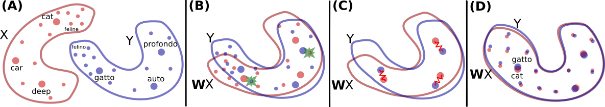

<h1 align="center">Univerdustry</h3>

<!-- 

---
 -->

Univerdustry is a machine learning based search engine. It uses Elasticsearch and MUSE library to build a semantic search for academic papers to find best academic consultants. 

## Table of Contents

---

- [Approach](#approach)
- [Services](#services)
- [Dataset](#dataset)
- [Vectorizing and Scoring](#vectorizing_and_scoring)
- [Online Learning](#online_learning)
- [TODO](TODO.md)  
- [Contributing](CONTRIBUTING.md)
- [References](#references) 

## Approach 

---

Mainly we have two part. One is front-end side which is developed by Vue.js framework. Vue is a progressive framework for building user interfaces. Unlike other monolithic frameworks, Vue is designed from the ground up to be incrementally adoptable. The core library is focused on the view layer only, and is easy to pick up and integrate with other libraries or existing projects. On the other hand, Vue is also perfectly capable of powering sophisticated Single-Page Applications when used in combination with modern tooling and supporting libraries.

Other is back-end side which is design as Micro Service Architecture. Microservices - also known as the microservice architecture - is an architectural style that structures an application as a collection of services that are

•	Highly maintainable and testable

•	Loosely coupled

•	Independently deployable

•	Organized around business capabilities

•	Owned by a small team

The microservice architecture enables the rapid, frequent and reliable delivery of large, complex applications. It also enables an organization to evolve its technology stack [[1]](#ref_01). 

We changed some parts of our first design while implementing. Firstly, we’ve changed our database paradigm as NoSQL. We have chosen MongoDB [[2]](#ref_02) instead of PostgreSQL. NoSQL databases (aka "not only SQL") are non-tabular, and store data differently than relational tables. NoSQL databases come in a variety of types based on their data model. The main types are document, key-value, wide-column, and graph. They provide flexible schemas and scale easily with large amounts of data and high user loads.

Also, we have added some extra services like Apache Tika [[3]](#ref_03) and remove some services like Scrapy.

## Services 

---

<b>Gateway</b> service is a kind of request handler. It handles all requests come from client and query backed service in order to give response to client. Also, it manages Vue.js application. It is built using Python Flask Web Framework. Flask is a micro web framework written in Python. It is classified as a microframework because it does not require particular tools or libraries. It has no database abstraction layer, form validation, or any other components where pre-existing third-party libraries provide common functions. However, Flask supports extensions that can add application features as if they were implemented in Flask itself. Extensions exist for object-relational mappers, form validation, upload handling, various open authentication technologies and several common framework related tools. Extensions are updated far more frequently than the core Flask program [[4]](#ref_04).

<b>MongoDB</b> service is our database engine. We store not indexed and queried data in MongoDB. MongoDB is a cross-platform document-oriented database program. Classified as a NoSQL database program, MongoDB uses JSON-like documents with optional schemas. MongoDB is developed by MongoDB Inc. and licensed under the Server-Side Public License (SSPL).

<b>Mongo Rest</b> service is a REST API to communicate with MongoDB service. We need this for high availability purpose. A RESTful API is an application program interface (API) that uses HTTP requests to GET, PUT, POST and DELETE data. An API for a website is code that allows two software programs to communicate with each other. The API spells out the proper way for a developer to write a program requesting services from an operating system or other application. A RESTful API -- also referred to as a RESTful web service or REST API -- is based on representational state transfer (REST), an architectural style and approach to communications often used in web services development . It is built using Python Flask Web Framework.

<b>Redis</b> service is used as a message broker for task queuing and scheduling. Redis is an open source (BSD licensed), in-memory data structure store, used as a database, cache and message broker. It supports data structures such as strings, hashes, lists, sets, sorted sets with range queries, bitmaps, geospatial indexes with radius queries and streams. Redis has built-in replication, Lua scripting, LRU eviction, transactions and different levels of on-disk persistence, and provides high availability via Redis Sentinel and automatic partitioning with Redis Cluster.

<b>Worker Rest</b> service is a REST API in order to control tasks. It can add tasks to queue using Redis service or stop a task and many task related operations. It is built using Python Flask Web Framework.

<b>Elasticsearch</b> service is a distributed, open source search and analytics engine for all types of data, including textual, numerical, geospatial, structured, and unstructured. Elasticsearch is built on Apache Lucene and was first released in 2010 by Elasticsearch N.V. (now known as Elastic). Known for its simple REST APIs, distributed nature, speed, and scalability. We use Elasticsearch to index data of academics and their publications. Also, we use it score documents using cosine similarity.

<b>Kibana</b> service is graphical user interface for Elasticsearch. We use Kibana for development purpose. We tried queries, analysed our data and scraping statistics.

<b>Scheduler</b> service is a Celery application which store schedule information and adds tasks into queue when the time comes. Celery. Celery is a task queue implementation for Python web applications used to asynchronously execute work outside the HTTP request-response cycle. Celery is an implementation of the task queue concept. Learn more in the web development chapter or view the table of contents for all topics.

<b>Worker</b> service is a Celery instance. It handles task getting from Redis service. It is replicable and we use 5 replicas to handle tasks.

<b>Flower</b> Service is a graphical user interface for workers and tasks in queue.

<b>Apache Tika</b> service is a content analysis toolkit The Apache Tika™ toolkit detects and extracts metadata and text from over a thousand different file types (such as PPT, XLS, and PDF). Tika is a project of the Apache Software Foundation, and was formerly a subproject of Apache Lucene. We use this service to extract texts of PDF files.

<b>Texter</b> service is our main service. It handles deep-learning-based text utilities. It is actually a web service and there are three main endpoints. It can vectorize e text, detect language of a text and translate a text to another language. We will get into detail in Section 4.3.

## Dataset 

---

For demonstration we need a dataset. But data of publications are mostly not public. We use Google Scholar to collect data. We collect list of academics in a university using university mail domain. We collect data of academics according to their university. After that we collect publication details of academics. If pdf file of a publication is publicly available, we downloaded it and extracted using Apache Tika. After extraction we detect language of text and vectorize it.

## Vectorizing and Scoring 

---

For text vectorization we use MUSE common space aligned vectors. MUSE is a Python library for multilingual word embeddings, whose goal is to provide the community with:

•	state-of-the-art multilingual word embeddings (FastText embeddings aligned in a common space)

•	large-scale high-quality bilingual dictionaries for training and evaluation

They include two methods, one supervised that uses a bilingual dictionary or identical character strings, and one unsupervised that does not use any parallel data [[5]](#ref_05). FastText is a library for learning of word embeddings and text classification created by Facebook's AI Research (FAIR) lab. The model allows to create an unsupervised learning or supervised learning algorithm for obtaining vector representations for words. Facebook makes available pretrained models for 294 languages. FastText uses a neural network for word embedding.
They provide multilingual embeddings and ground-truth bilingual dictionaries. These embeddings are FastText embeddings that have been aligned in a common space. We used these embedding to vectorize out textual data.

Advantages of using common space aligned data gives us cross language scoring while searching. For example, searching “Wireless Communication” in English and “Kablosuz İletişim” in Turkish are same scored results.

We store vector of textual data in Elasticsearch and query with scoring using cosine similarity of these vectors.

## Online Learning 

---

We are capable to get feedback an update our model to improve results. We have used update version of Rocchio algorithm. The Rocchio algorithm is based on a method of relevance feedback found in information retrieval systems which stemmed from the SMART Information Retrieval System which was developed 1960-1964. Like many other retrieval systems, the Rocchio feedback approach was developed using the Vector Space Model. The algorithm is based on the assumption that most users have a general conception of which documents should be denoted as relevant or non-relevant. Therefore, the user's search query is revised to include an arbitrary percentage of relevant and non-relevant documents as a means of increasing the search engine's recall, and possibly the precision as well [[6]](#ref_06).

 

We update document vectors if client gives feedback as relevant or irrelevant using above formula.

## References 

<b>[1] </b> microservices.io. 2020. What Are Microservices?. [online] Available at: <https://microservices.io/> [Accessed 28 June 2020].

<b>[2] </b> MongoDB. 2020. The Most Popular Database For Modern Apps. [online] Available at: <https://www.mongodb.com/> [Accessed 28 June 2020].

<b>[3] </b> Tika.apache.org. 2020. Apache Tika – Apache Tika. [online] Available at: <https://tika.apache.org/> [Accessed 28 June 2020].

<b>[4] </b> En.wikipedia.org. 2020. Flask (Web Framework). [online] Available at: <https://en.wikipedia.org/wiki/Flask_(web_framework)> [Accessed 28 June 2020].

<b>[5] </b> GitHub. 2020. Facebookresearch/MUSE. [online] Available at: <https://github.com/facebookresearch/MUSE> [Accessed 28 June 2020].

<b>[6] </b> En.wikipedia.org. 2020. Rocchio Algorithm. [online] Available at: <https://en.wikipedia.org/wiki/Rocchio_algorithm> [Accessed 28 June 2020].
